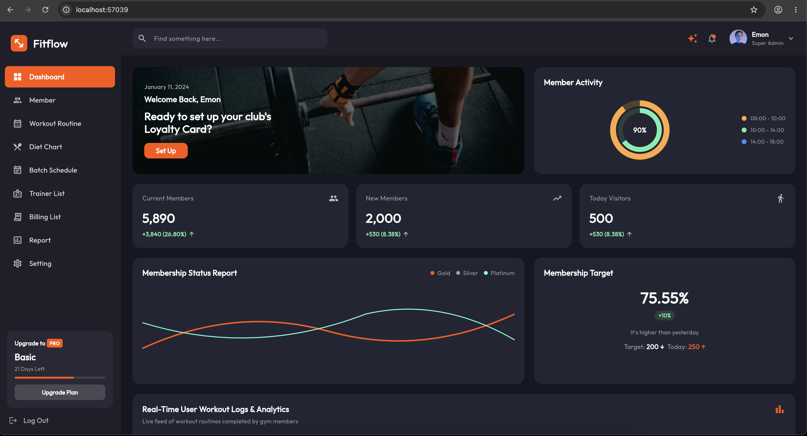
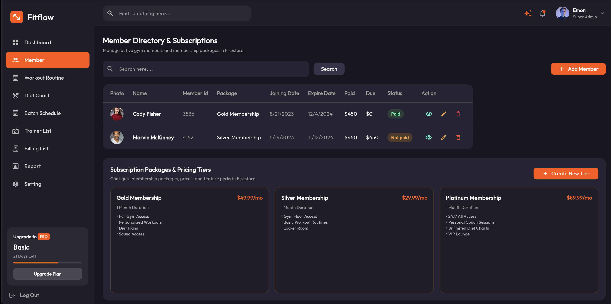
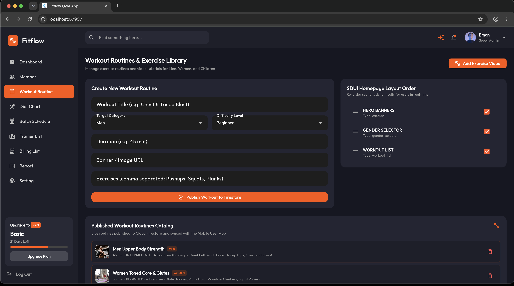
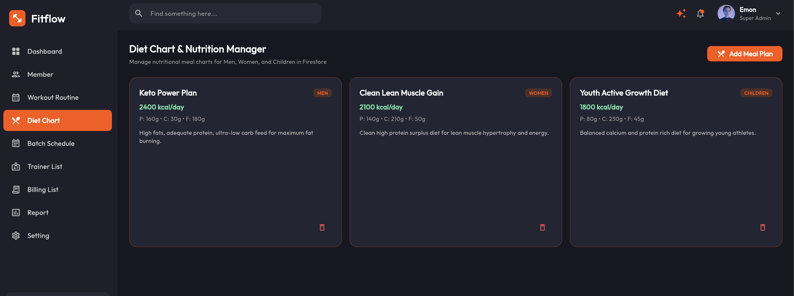
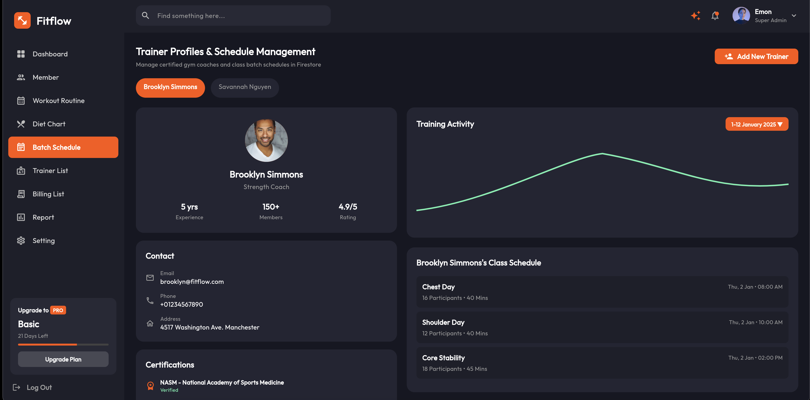
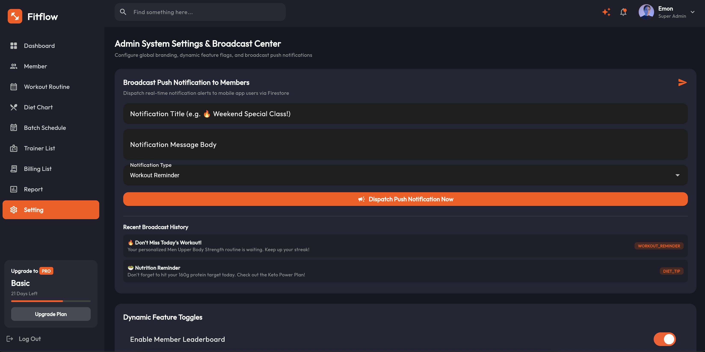

# FitFlow - Gym Training Pro

FitFlow is a comprehensive fitness and gym management application built with Flutter. It utilizes a modular, multi-package architecture to separate concerns, making the codebase scalable and maintainable. It includes an integrated admin dashboard, server-driven UI capabilities, and leverages Firebase for robust backend services.

---

## 🖥️ Admin Dashboard Showcase

Here is a detailed walkthrough of the **FitFlow Web Admin Portal** screens along with their key functionalities:

### 1. 📊 Executive Dashboard Overview

* **Title**: Main Dashboard & Executive Overview
* **Description**: Provides gym administrators with a high-level real-time summary of key performance indicators (KPIs), including active members count, new monthly signups, daily visitor traffic, membership package distribution graphs, and live member workout activity logs.

---

### 2. 👥 Member Directory & Subscriptions

* **Title**: Member Management & Subscription Tier Portal
* **Description**: Enables admins to search, filter, add, edit, or remove gym members. Includes payment status tracking (Paid vs. Not Paid), due amounts, digital pass QR code assignments, and a full pricing tier manager for Gold, Silver, and Platinum memberships.

---

### 3. 🏋️‍♂️ Workout Routines & Exercise Library

* **Title**: Workout Creator & Server-Driven UI (SDUI) Layout Controller
* **Description**: Allows management of exercise routines for Men, Women, and Children. Includes a live **SDUI Layout Order** manager that lets administrators dynamically re-order homepage sections (Hero Banners, Gender Selectors, Workout Lists) in real-time without pushing app updates.

---

### 4. 🥗 Diet Chart & Nutrition Manager

* **Title**: Nutritional Meal Plans & Macro Configurator
* **Description**: Configure daily target calories, protein, carb, and fat macro breakdowns across target member categories. Admins can create and assign customized nutrition plans like Keto Power, Clean Muscle Gain, and Youth Growth diets.

---

### 5. 👨‍🏫 Trainer Profiles & Batch Schedule Management

* **Title**: Certified Coach Directory & Class Scheduling
* **Description**: Manage gym trainers, their certifications, years of experience, member ratings, and class schedules (e.g., Chest Day, HIIT Cardio, Core Stability). Syncs seamlessly with member class booking requests.

---

### 6. ⚙️ Admin System Settings & Broadcast Center

* **Title**: Push Notification Broadcaster & Dynamic Feature Toggles
* **Description**: Allows super admins to dispatch instant push notifications (e.g., workout reminders or diet tips) directly to members' mobile devices. Also features live feature toggles to instantly enable or disable app modules like the Community Leaderboard.

---

## 🚀 Features

*   **Modular Architecture:** Clean separation of concerns with dedicated packages for Domain, Data, Features, Core UI, and Server-Driven UI (SDUI).
*   **User App (Gym App):**
    *   **Home View:** Main dashboard and navigation.
    *   **Workout Tracking:** Active workout view and detailed exercise modals.
    *   **Community Hub:** Connect with other gym members.
    *   **Nutrition Hub:** Access diet charts and nutrition planning.
    *   **Recovery Hub:** Recovery tracking and wellness tips.
    *   **Trainer Booking:** Browse and book personal trainers easily.
    *   **Membership Pass:** Digital membership access card.
*   **Admin Dashboard:**
    *   Comprehensive analytics and dashboard overview.
    *   Member list and profile management.
    *   Trainer details and scheduling.
    *   Workout routine and diet chart configuration.
*   **Server-Driven UI (SDUI):** Dynamically render UI components like workout lists, banner carousels, and gender selectors based on backend configurations without needing app updates.
*   **Firebase Integration:** Powered by Firebase (Firestore, Storage, Auth) for seamless real-time data synchronization and secure authentication.

---

## 📁 Project Structure

This project follows a multi-package repository structure to ensure modularity:

*   **`apps/gym_app`**: The main Flutter application entry point. It wires together the various features and configurations.
*   **`packages/`**:
    *   **`domain`**: Contains core business logic, entities (Member, Trainer, Workout, DietPlan, etc.), and repository interfaces. Independent of Flutter and data layers.
    *   **`data`**: Implements the repository interfaces defined in the domain layer. Handles data fetching and persistence using Firebase with local fallback support.
    *   **`core_ui`**: Reusable UI components, themes (Dynamic Theme Builder), and styling used consistently across the application.
    *   **`sdui`**: Server-Driven UI framework to dynamically build screens based on JSON payload configurations.
    *   **`features/`**: Modular, self-contained feature packages.
        *   **`admin`**: The entire admin dashboard and management suite.
        *   **`auth`**: User authentication flows.
        *   **`workout`**: Core workout execution and tracking features.

---

## 🛠️ Getting Started

### Prerequisites

*   [Flutter SDK](https://flutter.dev/docs/get-started/install) (Latest stable version recommended)
*   [Dart SDK](https://dart.dev/get-dart)
*   Firebase project setup

### Installation & Setup

1.  **Clone the repository:**
    ```bash
    git clone https://github.com/ADILAYOUB/Gym-Feature-base-repo-with-admin-panel-.git
    cd Gym-Feature-base-repo-with-admin-panel-
    ```

2.  **Fetch Dependencies:**
    Navigate to the root and the app directory to get dependencies.
    ```bash
    flutter pub get
    cd apps/gym_app
    flutter pub get
    ```

3.  **Firebase Configuration (Required):**
    For security reasons, sensitive Firebase configuration files are **not** included in version control. You can provide your own configuration:
    
    *   **Android:** Place your `google-services.json` file in `apps/gym_app/android/app/`.
    *   **iOS:** Place your `GoogleService-Info.plist` file in `apps/gym_app/ios/Runner/`.
    *   **Dart Initialization:** Use the [FlutterFire CLI](https://firebase.flutter.dev/docs/cli/) to generate `firebase_options.dart` if desired.
    ```bash
    flutterfire configure
    ```

4.  **Run the app:**
    ```bash
    cd apps/gym_app
    flutter run
    ```

---

## 🔐 Security Note

Sensitive files like `google-services.json`, `GoogleService-Info.plist`, and `.env` files are ignored via `.gitignore` to prevent accidental exposure of keys to GitHub.

---

## 📄 License

This project is open-source and available under standard terms.
